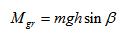
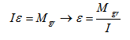
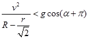

# Virtual Physical Laboratory “Loop the Loop”

**Project Mission:** to develop a virtual physical laboratory for simulation of the ball rolling through loop-the-loop with various initial conditions

**Programming Language:** C++

**Framework:** Qt4 / Qt5 / Qt6

**License:** [GNU GPL v3](http://www.gnu.org/copyleft/gpl.html)

This software simulates the ball rolling through loop-the-loop (vertical loop, where a section of track completes a 360 degree circle). The software allows you to adjust the following parameters of the model: starting ramp angle, starting ramp lenght, loop radius and ball radius.

The software allows you to plot graphs of the following functions:
 * Ball speed
 * Ball angular velocity
 * Height (the distance from the lowest point of the trough to the ball)

## Model

This software simulates the movement of a ball by rolling without slide through rectangular trough formed in a loop the loop.

> 
>
> *The trajectory of the center of the ball when it passing the loop*

 * β - starting ramp angle
 * L - starting ramp lenght
 * R - loop radius
 * r - ball radius
 * α - current angle, which characterizes the position of the ball

Movement of the ball is divided into four main stages: movement on the starting ramp, movement on the entrance to the loop sector β, movement in the loop and rolling on a horizontal section of the trough.

To solve the problem, we need to create a equation of the rotational movement of a rigid body around the axis.

> 

It is necessary to calculate the moment of inertia. At any given point in time the rotation of the ball around a fixed axis coincides with the instantaneous axis of rotation. We know the moment of inertia of the ball in relation to axis passing through the center of mass. We found the distance between the axles, then we will use the Steiner`s theorem:

> 
>
> 
>
> *The cross-section of the ball and the trough*

Rotation of the rolling ball occurs around the axis defined by the dotted line.

Using of the Steiner`s theorem.

> 

The first section of the movement of the ball:

The equation of the rotational movement of a rigid body has only gravitation moment relative to the current axis not equal to zero.

> 

We can calculate the characteristics of the ball:

> 
>
> 

We calculate the angular acceleration and instantaneous acceleration of the ball in the second section in the same way. We consider the motion as a circular motion (the dotted line in the figure corresponds to the trajectory of the ball center).

The angle α varies from - β to 2π

> 
>
> 

Because , α is calculated using a Euler method.

> 

The offset along another axis separates the third section from the second section (the movement occurs in the loop instead of a closed circle).

The movement on the last section: 

> 

Fall event occurs if:

> 

