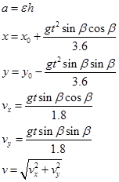
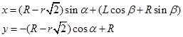

# Виртуальная физическая лаборатория «Мёртвая петля»

**Цель проекта:** разработать программный продукт, представляющий собой виртуальную физическую лабораторию, моделирующую движение шарика в «мёртвой петле» при различных начальных условиях

**Язык программирования:** C++

**Фреймворк:** Qt4 / Qt5 / Qt6

**Лицензия:** [GNU GPL v3](http://www.gnu.org/copyleft/gpl.html)

В программе моделируется поведение шарика, который совершает «Мёртвую петлю», то есть катится по круговому сектору. В модели можно изменять: угол наклона начального сектора (по которому шар набирает скорость), его длину, радиус проходимой шаром окружности и радиус шара.

В программе выводятся графики:
 * скорость шара
 * угловая скорость шара
 * изменение высоты шара относительно нижней точки желоба

## Модель

В рамках данного проекта мы моделируем движение шарика с качением без скольжения в «мёртвой петле», образованной прямоугольным желобом.

> 
>
> *Траектория движения центра шарика при прохождении петли*

 * β - угол наклона начального участка
 * L - длина начального участка петли
 * R - радиус петли
 * r - радиус шарика
 * α - текущий угол, с помощью которого задаём положение шарика

Движение шарика разбивается на четыре основных участка: движение по наклонной части желоба, движение по входному в петлю сектору β, движение в петле и выкатывание шарика по горизонтальному участку желоба.

Поскольку мы имеем дело с качением, для решения задачи нам необходимо составить уравнение динамики вращательного движения твёрдого тела относительно оси вращения.

> 

Необходимо вычислить момент инерции. Рассмотрим вращение шарика относительно неподвижной оси, совпадающей в данный момент времени с мгновенной осью вращения. Нам известен момент инерции шарика относительно оси, проходящей через центр масс. Поэтому мы можем воспользоваться теоремой Штейнера, если найдём расстояние между осями:

> 
>
> 
>
> *Поперечное сечение шарика и желоба*

Вращение шарика при качении происходит вокруг оси, обозначенной пунктиром.

Воспользуемся теоремой Штейнера.

> 

Теперь рассмотрим первый участок движения шарика:

Относительно данной оси в уравнении динамики вращательного движения твёрдого тела ненулевым является только момент силы тяжести.

> 

Мы можем вычислить характеристики шарика:

> 
>
> 

На втором участке при расчёте углового ускорения шарика и мгновенного ускорения поступаем аналогично. Движение рассматриваем как движение по окружности (пунктир на рисунке соответствует траектории движения центра шарика).

Угол α изменяется от – β до 2π

> 
>
> 

Так как , найдём α при помощи метода Эйлера. Реализация его алгоритма находится непосредственно в коде.

> 

Третий участок отличается от второго смещением по ещё одной оси координат (необходимо для движения именно по петле, а не по замкнутой окружности).

Движение по последнему участку: 

> 

Случай падения находим, если выполняется:

> 

